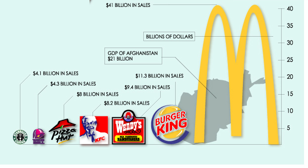
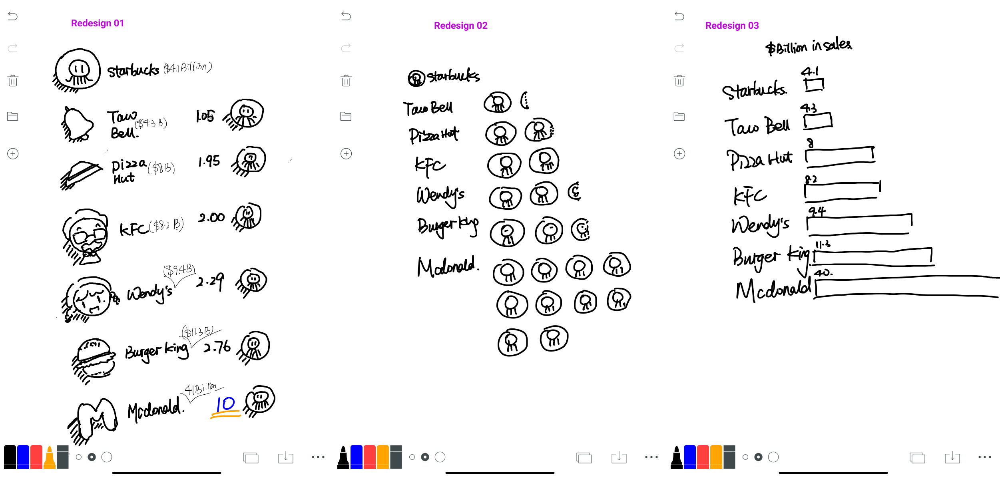

Mainpage(/README.md)

# Original Data Visualization

*** Source from: http://www.princeton.edu/~ina/infographics/starbucks.html

Here is the data visualization I found on the website. The graph is pretty interesting because it utilized the size of logo to represent the sales of different stores. However, the methods is a bit tricky because it is hard to show the ratio of areas accurately and also the whole design here makes the visualization complicated and hard to understand. 

# My Process
I firstly observed the diagram and tried to clarify the main target users, which would be anyone who is interested in the revenue scale of popular restaurants. Aftering finishing the critique method, I concluded several interestng insights:

1. Less is more. When we design diagrams, too much effort on visualization may make the visualization less intuitive for readers. It is really important to choose appropriate viualization method.

2. Accuracy is important in data visualization. When critiquing "trustworthy", I realized that the diagram was not accurate enough to reflect the ratio of revenue of various restaurants. Giving viewers clear and more accurate impression on data should also be the focus of the redesign.

Based on what I got from the critiques, I developed three redesign solutions: 
  

Here are some comments and critiques I got from two interviews:

1. Pay attention to key elements. In the diagram, the most important element should be the revenue of Mcdonald. However, in the first redesign, the key element is less emphasized and it is harder for readers to get the clear sense for the most important element.

2. It is not clear that Starbucks worked as a measurement here. More information may need here to explain how the diagram works. 

I then developed the final redesign:

