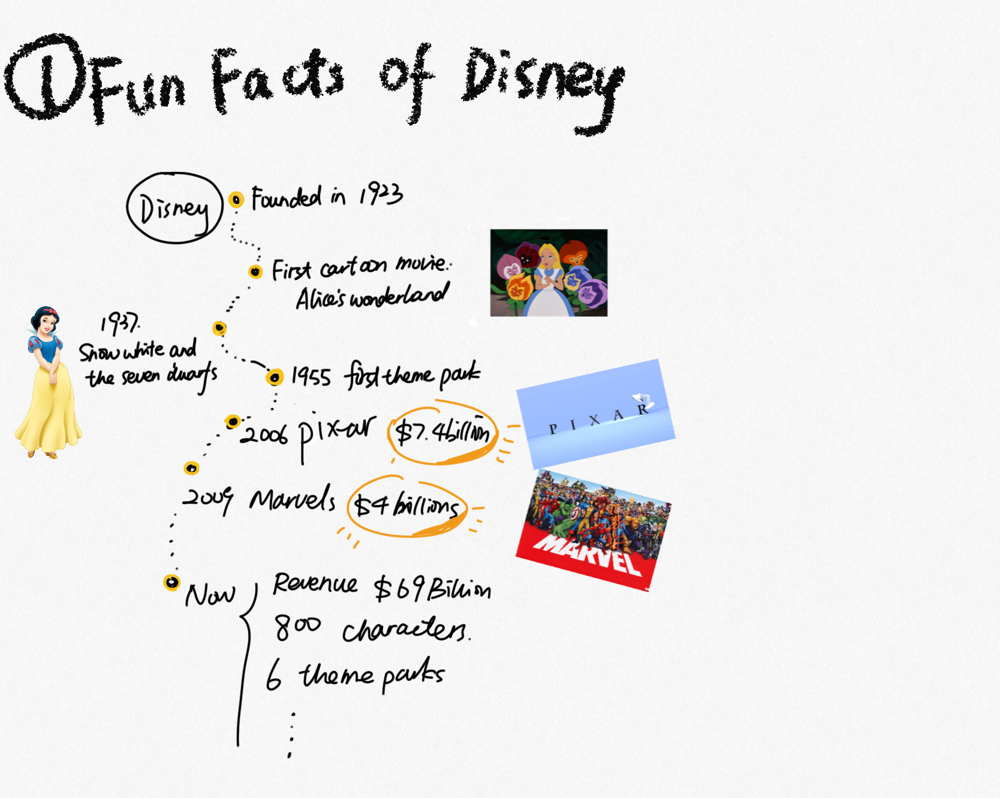
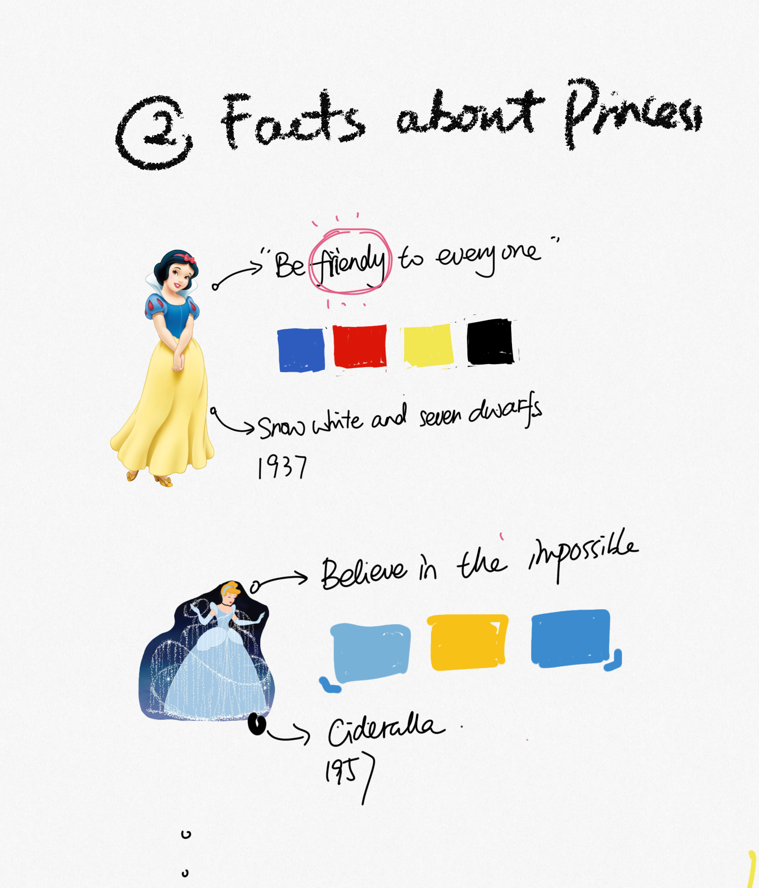
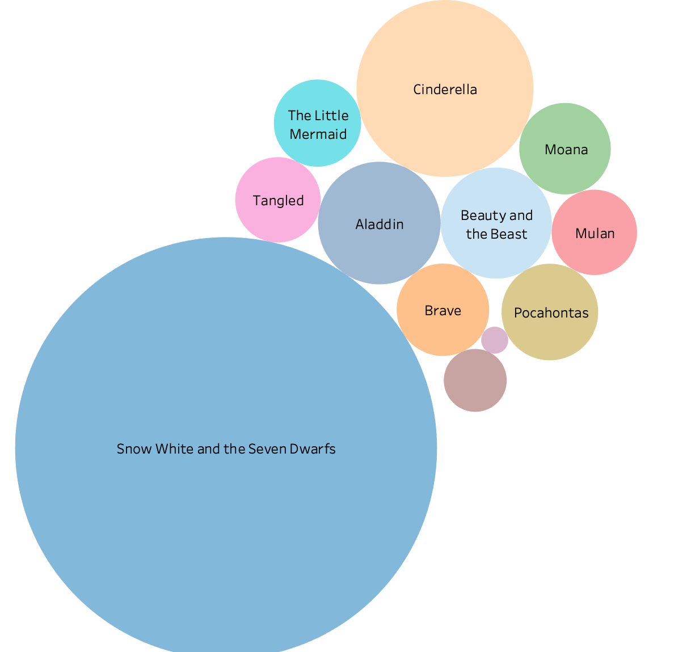
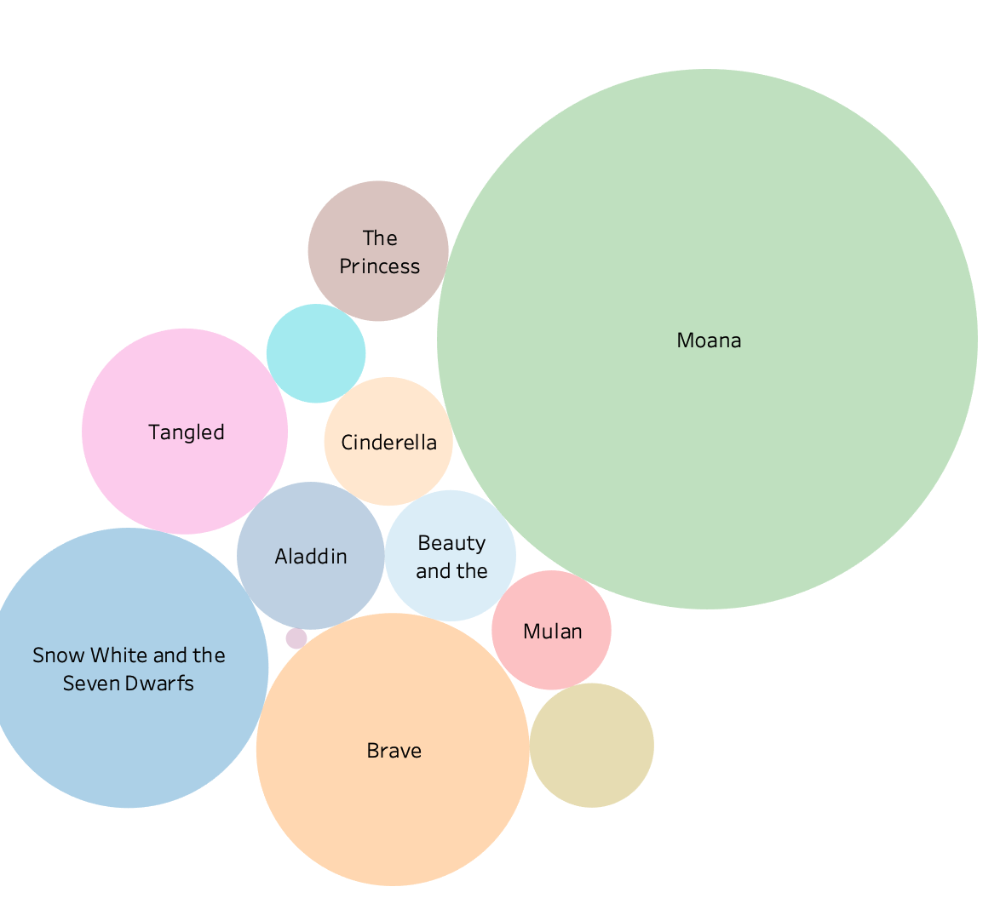

# What is the wealthiest princess like in the Disney world?

## Outline

### Why the topic?
With the brand value of 19 billions, Disney is one of the most profitable companies in the world and also bring hope and love to millions of people. As a big fan of Disney movies, I am really curious about what contributes to Disney's profits most and the most profitable character they created.

### Some facts about Disney
（visualize the information here) First found 1923 -- First Cartoon movie: Alice’s Wonderland -- 1937  Snow White and the Seven Dwarfs --  1955 first theme park, Disneyland, in Anaheim, California -- December 1966,Walt Disney passed away 
--May 2006, Disney purchased Pixar for $7.4 billion -- In 2009, Disney purchased Marvel Entertainment for about $4 billion -- Now Disney revenue $69.570 billion, 800 Disney Characters,6 Dsineyland
Among all the characters, princess is an important series

### Facts about Disney princesses
1. Brief introduction of these princesses, their movies and their popularity 
2. Diagram to show the correlation between their color and their charateristics

### How much do these princess earn？
Diagram 01: shows the overall gross revenue of these movies
Diagram 02: shows the gross revenue per year of these movies

### Conclusion
CompaAre these two diagram and conclude some points and list the richest princess under each diagram.

## Dataset
I used two resources to finish the topic. Firstly, the revenue information comes from the open dataset: https://www.kaggle.com/prateekmaj21/disney-movies. I extracted movies related to Disney princess and calculate gross revenue per year according to the data. I would use the data to showcase ”how wealth these princess are" and " their capability in earning money". 

The other one is the character analysis of these princesses:https://princess.disney.com/. I would utilize some color picker tool to match colors with their characteristics. 

## Interview protocol
a. The target audience of my story is the fans of Disney and anyone who is interested in the topic. 
b. I interviewed two of my friends who are extremely interested in Disney topics and also I interviewed one friend who is not that into the topic to see if my story can still interest him to some extent.
c. My interview script
Hi I am Yue. I’m conducting interviews to test my data visualiation project in ‘Telling Stories With Data’. Thank you very much again for letting me interview you.
I would like to go through the story with you. If you find any pitfall in the storytelling, please feel free to jump in.
<Introduce the outline and content>
 Questions

 1. Do you think the project answer the question "What is the wealthiest princess like in the Disney world?“？

 2. Do you have any other information that can be added?

 3. Do you think there is any information unecessary here?

 4. What do you think of the data visualization here? Are they understandable and useful to understand the story？

 Part1: Some facts about Disney
 

 Part2: Facts about Disney princesses 
 

 Part3: Data visualization
 
 
 
 
d. the findings from your interviews; and 
e. changes you implemented to your sketches, storyboards and wireframes to address the issues identified.
